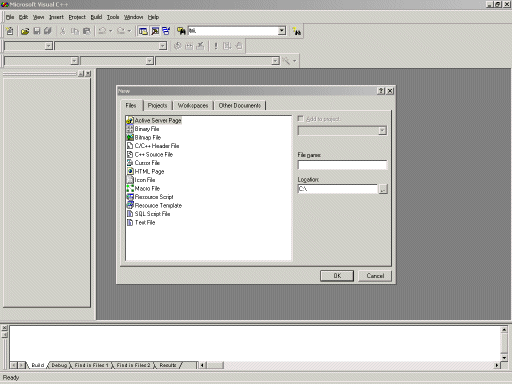

# C++ tutorial

> A chapter of featherless' [digital creative history](https://github.com/featherless/digital-creative-history).

> Note from 28 year old Jeff: I wrote this tutorial when I was 15, shortly after having just learned the language myself.
> Lovely gems abound including "30 megs of space in total, and that's A LOT OF SPACE".

### Intro to the VERY basics of programming

Programming is all about typing up information (code) and then sending it through a compiler, which will then generate a .exe file, which means that you can take that .exe and use it whenever you would like.  

##### Basic Vocab

**Code**- The information that you type up in a program of your choice that will be used to make the .exe  
**Variables**- Ok, these are kinda hard to explain to newbs, but here's a semi-visual that should help: Ok, picture a hollow box, with the top cut off. Now, imagine sticking something in there that you want to be able to take out and look at and change a lot, and then closing it. That is essentially what a variable is: A bit of stored information (whether it be a number, string, or anything else).  
**Strings**- Strings are technically sentences, every bit of text you see typed here is a string. Strings can be anything from numbers to letters.  
**Compiler**- Compilers are the programs that you use to "compile" your finished code in to an exe file so you can use it. Microsoft Visual Studio is a very good example.  
**Input**- Input is an essential part of programming. Input involves the user typing something into the keyboard, moving their mouse/joystick, or even talking in to a microphone. All input is used in some way and generally results in some sort of output.  
**Output**- Output is anything that affects your senses. Your moniter is the main source of output, and the speakers also.  
**Header Files**- Header files are any files with a .h at the end. All header files allow you to use more and more commands in your program. Why not just use all of the header files in one program? Well, I've thought of that, and the biggest reason why you wouldn't want to do that is because it would take up A LOT OF SPACE. Just all of the included header files with MSVS is over 1000 files with almost 30 megs of space in total, and that's A LOT OF SPACE considering they are basically text files.

That should be all of the basic info you need to know, but otherwise, just email me (ragingflame@msn.com) and I'll add it to this tutorial.

## Jeff Verkoeyen's C++ Programming Tutorial

### Written October 11, 2002

#### /* Intro */

### Welcome to Jeff Verkoeyen's C++ Tutorial. First of all, I am hoping that you have a copy of Microsoft Visual Studio with you, because you won't be able to compile any of the programs in this tutorial. So, in other words, if you don't have Microsoft Visual Studio on your computer, it is kind of pointless reading this tutorial...  
If you aren't sure as to whether or not you have Visual Studio, it should be in this folder, unless it was installed somewhere else:  
**C:\Program Files\Microsoft Visual Studio\Common\MSDev98\Bin\MSDEV.EXE**

Now that we've made sure you CAN actually use this tutorial, it's time to introduce myself. At the time that I am writing this tutorial, I am 15 years old, and have been programming C++ for about 5-6 months now (I also know a lot of other languages). Some of my games/programs include an RPG, still in development, a 3D-Polygon Placement program, and a remake of Asteroids in 3D.

Also, if you have no idea about absolutely ANYTHING about programming, look [here]().

#### /* Lesson 1 */

### [First, if you are just new to programming in C++, you need to know the BASIC basics...Comments. Comments have to be one of the most used things in C++ (hehe), mainly because that way you'll remember what's going on in your program later on, and you won't be scratching your head, wondering...hmm, what did that do again?]()

##### Intro to how this Tutorial works-

##### Any new commands will be indented, like this-

### [    **Comments** :: Text that can be typed anywhere in your program, because it will not be read by the compiler.  
    **Example1** :: /* Hello */  
    **Example2** :: // Hello  
    **Details** :: Example1 is a very helpful type of comment, because of the fact that it is not restricted to only one line of code. However, in example 2, only the code directly following the // on the same line will be commented.  
    **Required Header Files** :: NoneNow that you should understand the basics of this tutorial, on to the basics! First off, comments. Like I said above, comments are one of the most essential things you can have. Here are a couple more examples, in case you didn't understand the above. ]()

##### Example 1.1:

### [#include &lt;iostream.h&gt;int main()  
{ > // This whole line of text will not be read by the compiler  
/* Neither will these next three lines, because of the fact  
that the it keeps reading it as a comment until you end  
it  
*/cout &lt;&lt; "Hello World"; return 0;  } There, that is your first example of code, really basic to start out with, but this is a good start nonetheless. Next, I will introduce you to the basic structure of a C++ program, and how to compile and run it in Microsoft Visual Studio. ]()

#### /* Lesson 2 */

### [First, load up MVS (Microsoft Visual Studio) and click File, New, and then click files. Your screen should look like this:  
Double click on C++ Source File, and it will load up a new .cpp file. Now, first off, I'll introduce to you just some basic Input and Output, starting with cout ]()

[    **cout** :: Used to output text to the screen at the current cursor position.  
    **Example1** :: cout &lt;&lt; "Hello World!";  
    **Example2** :: cout &lt;&lt; "Hello world, I am" &lt;&lt; age &lt;&lt; " years old.";  
    **Details** :: The cout statement allows for many different combinations of output. You can output variables, text, and everything else that has some sort of a value.  
    **Required Header Files** :: iostream.h]()

[    **cin** :: Used to input information from the keyboard to a variable.  
    **Example1** :: cin &gt;&gt; name;  
    **Example2** :: cin &gt;&gt; a &gt;&gt; b &gt;&gt; c &gt;&gt; d &gt;&gt; age;  
    **Details** :: The cin command is used for one purpose only, to receive any input from the keyboard, and store it to a variable. For instance, you could say cin &gt;&gt; a; and then whatever you typed into that variable would be saved there.  
    **Required Header Files** :: iostream.h]()

[Here is an example of a program using the cout command, you can copy/paste this in to MSVS if you want, but I'd type it word by word if I were you (just to help reinforce it all).]()

##### [Example 2.1:]()

### [#include &lt;iostream.h&gt;int main()  
{ cout &lt;&lt; "Hello World";cout &lt;&lt; "This is being displayed to your screen using the cout command!"; return 0;  } Now is your first big step in to the world of programming: your first program!  
First, copy/paste/type the code in to MSVS, then click the button that looks like this-  or if that isn't there, click Build, Compile.  
  
However you managed to compile it, it should pop up with a warning that looks somewhat like this-  
  
Say yes, and then it will ask you where you would like to save it. If I were you, I'd create a new folder for this whole tutorial, that way it will be a lot easier to work with and find later on.  
Click ok and save it, then it should start whirring away, and at the bottom (once it's finished) it should say something like this-  
  
Now you are ready to run your program. First off, for the sake of your computers memory, you'll want to compile it to a Release type, instead of Debug. To change that setting, right click anywhere on your toolbars, and a small menu thing should pop up. Make sure that the Build toolbar is on. Now that that is on, click the button Win32 Debug, and change it to Win32 Release. Now that that's all set up, click the button that looks like this-  or if you can't find that (it's on the build bar), press ctrl-F5, or if you don't know how to do that...sheesh....press Build, Execute. Now that your program is compiling in to a .exe, it should pop up in a couple seconds, depending on how fast your computer is.  
Once your program is finished compiling, it should pop up with a COMMAND PROMPT that will look something like this-  
 ]()

> A chapter of featherless' [digital creative history](https://github.com/featherless/digital-creative-history).
